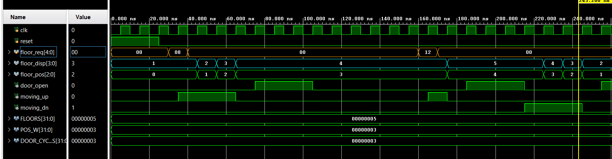

# Simulation Report – Verilog Elevator Controller

## 1. Simulation Setup
- Simulator: Vivado Simulator
- Clock period: 10 ns
- FLOORS = 5
- DOOR_CYCLES = 3

## 2. Test Cases

### Test Case 1: Single floor request
- Initial floor: 1
- Request: floor 3
- Result: Elevator moves UP → STOP → DOOR

### Test Case 2: Multiple requests
- Requests: floor 2 and floor 4
- Behavior: Elevator services requests in correct direction order

### Test Case 3: Request cancellation
- Request removed before arrival
- Result: Door does not open

## Schematics

## Waveform Analysis

## 4. Conclusion
The RTL design behaves correctly under all tested scenarios.